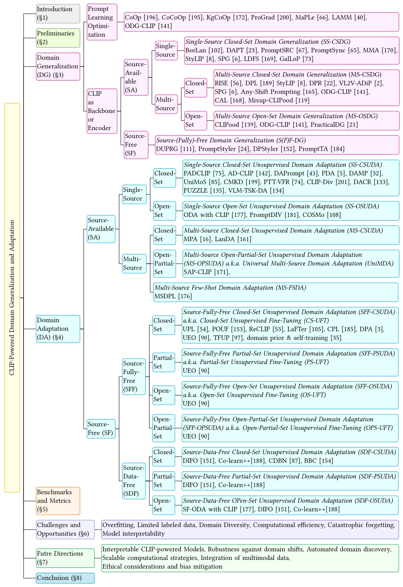
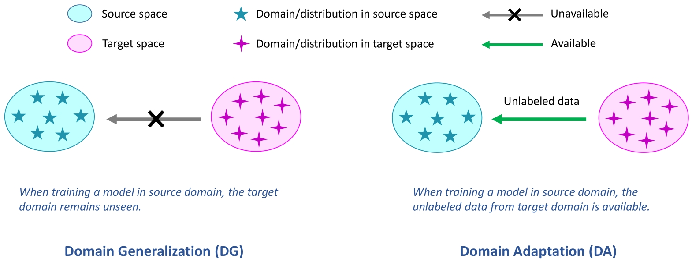
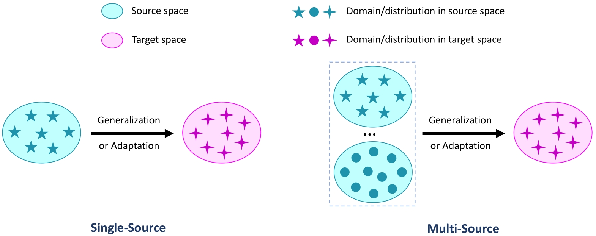
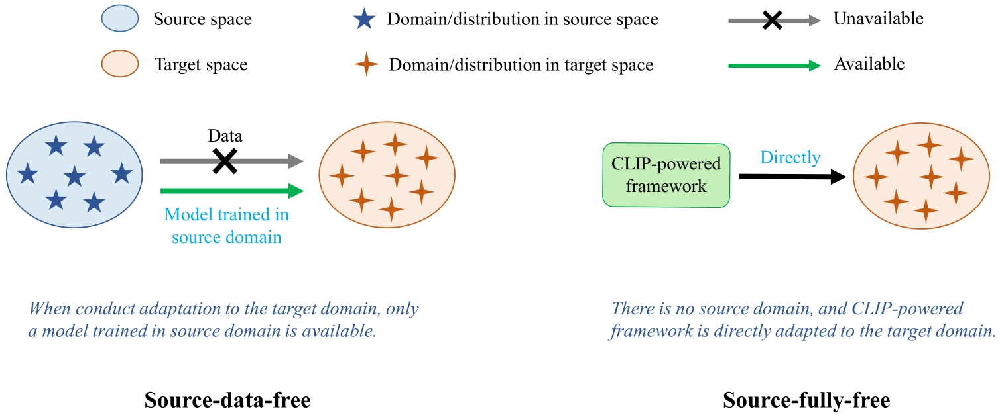
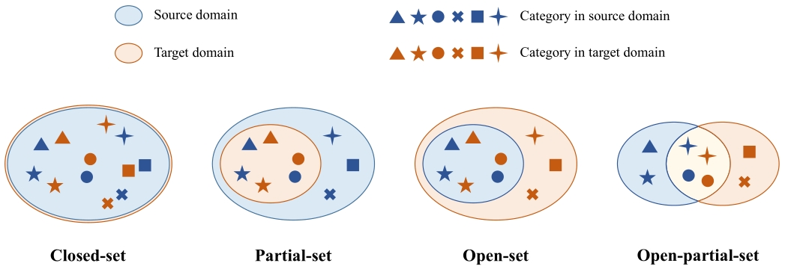
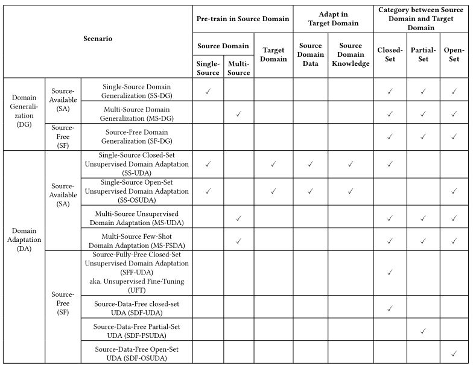

# A Comprehensive Survey on CLIP Powered Domain Generalization and Adaptation: Review and Beyond

    

 
 

    

 
 

    

 
 

    

 
 

    

 

## Domain Generalization

### Prompt Learning Optimization
1. [Learning to prompt for vision-language models](https://arxiv.org/abs/2109.01134)
2. [Conditional prompt learning for vision-language models](https://arxiv.org/abs/2203.05557)
3. [Maple: Multi-modal prompt learning](https://arxiv.org/abs/2210.03117)
4. [LAMM: Label Alignment for Multi-Modal Prompt Learning](https://arxiv.org/abs/2312.08212)

### Adopted as Backbone or Encoder
#### Source-Available (SA)
##### Single-Source Domain Generalization (SS-DG)
1. [StyLIP: Multi-Scale Style-Conditioned Prompt Learning for CLIP-based Domain Generalization](https://arxiv.org/abs/2302.09251)
2. [Soft Prompt Generation for Domain Generalization](https://arxiv.org/abs/2404.19286)
##### Multi-Source Domain Generalization (MS-DG)
1. [A Sentence Speaks a Thousand Images: Domain Generalization through Distilling CLIP with Language Guidance](http://export.arxiv.org/abs/2309.12530)
2. [StyLIP: Multi-Scale Style-Conditioned Prompt Learning for CLIP-based Domain Generalization](https://arxiv.org/abs/2302.09251)
3. [Disentangled Prompt Representation for Domain Generalization](https://ieeexplore.ieee.org/abstract/document/10655401)
4. [Leveraging Vision-Language Models for Improving Domain Generalization in Image Classification](https://cvpr.thecvf.com/virtual/2024/poster/31364)
5. [Soft Prompt Generation for Domain Generalization](https://arxiv.org/abs/2404.19286)
6. [Any-Shift Prompting for Generalization over Distributions](https://openaccess.thecvf.com/content/CVPR2024/papers/Xiao_Any-Shift_Prompting_for_Generalization_over_Distributions_CVPR_2024_paper.pdf)

#### Source-Free (SF)
##### Source-Free Domain Generalization (SF-DG)
1. [Domain-Unified Prompt Representations for Source-Free Domain Generalization](https://arxiv.org/abs/2209.14926)
2. [PromptStyler: Prompt-driven Style Generation for Source-free Domain Generalization](https://arxiv.org/abs/2307.15199)
3. [DPStyler: Dynamic PromptStyler for Source-Free Domain Generalization](https://arxiv.org/abs/2403.16697)
4. [PromptTA: Prompt-driven Text Adapter for Source-free Domain Generalization](https://arxiv.org/abs/2409.14163)

## Domain Adaptation
### Source-Available (SA)
#### Single-Source (SS)
##### Source-Available Domain Adaptation (SA-DA)
##### Single-Source Closed-Set Unsupervised Domain Adaptation (SS-UDA)
1. [PADCLIP: Pseudo-labeling with Adaptive Debiasing in CLIP for Unsupervised Domain Adaptation](https://ieeexplore.ieee.org/document/10377727)
2. [AD-CLIP: Adapting Domains in Prompt Space Using CLIP](https://ieeexplore.ieee.org/document/10351000)
3. [Domain Adaptation via Prompt Learning](https://ieeexplore.ieee.org/document/10313995)
4. [Prompt-based Distribution Alignment for Unsupervised Domain Adaptation](https://arxiv.org/abs/2312.09553v1)
5. [Domain-Agnostic Mutual Prompting for Unsupervised Domain Adaptation](https://arxiv.org/abs/2403.02899)
6. [Split to Merge: Unifying Separated Modalities for Unsupervised Domain Adaptation](https://arxiv.org/abs/2403.06946v1)
7. [Unsupervised Domain Adaption Harnessing Vision-Language Pre-training](https://arxiv.org/abs/2408.02192)
8. [Empowering Unsupervised Domain Adaptation with Large-scale Pre-trained Vision-Language Models](https://ieeexplore.ieee.org/document/10484237)

##### Single-Source Open-Set Unsupervised Domain Adaptation (SS-OSUDA)
1. [Open-Set Domain Adaptation with Visual-Language Foundation Models](https://arxiv.org/abs/2307.16204)
2. [Decoupling Domain Invariance and Variance With Tailored Prompts for Open-Set Domain Adaptation](https://ieeexplore.ieee.org/document/10647719)
3. [COSMo: CLIP Talks on Open-Set Multi-Target Domain Adaptation](https://arxiv.org/abs/2409.00397v1)

#### Multi-Source (MS)
##### Multi-Source Unsupervised Domain Adaptation (MS-UDA)
1. [Multi-Prompt Alignment for Multi-Source Unsupervised Domain Adaptation](https://arxiv.org/abs/2209.15210)
2. [LanDA: Language-Guided Multi-Source Domain Adaptation](https://arxiv.org/abs/2401.14148)
3. [Semantic-Aware Adaptive Prompt Learning for Universal Multi-Source Domain Adaptation](https://ieeexplore.ieee.org/document/10502133)

##### Multi-Source Few-Shot Domain Adaptation (MS-FSDA)
1. [Domain Prompt Matters a Lot in Multi-Source Few-Shot Domain Adaptation](https://openreview.net/forum?id=YRJDZYGmAZ)

### Source-Free (SF)
#### Source-Fully-Free (SFF)
##### Source-Fully-Free Closed-Set Unsupervised Domain Adaptation (SFF-CSUDA) a.k.a. Unsupervised Fine-Tuning (CS-UFT)
1. [Unsupervised Prompt Learning for Vision-Language Models](https://arxiv.org/abs/2204.03649)
2. [POUF: Prompt-oriented unsupervised fine-tuning for large pre-trained models](https://arxiv.org/abs/2305.00350)
3. [ReCLIP: Refine Contrastive Language Image Pre-Training with Source Free Domain Adaptation](https://arxiv.org/abs/2308.03793)
4. [LaFTer: Label-Free Tuning of Zero-shot Classifier using Language and Unlabeled Image Collections](https://arxiv.org/abs/2305.18287)
5. [Candidate Pseudolabel Learning: Enhancing Vision-Language Models by Prompt Tuning with Unlabeled Data](https://arxiv.org/abs/2406.10502)
6. [DPA: Dual Prototypes Alignment for Unsupervised Adaptation of Vision-Language Models](https://arxiv.org/abs/2408.08855)
7. [Realistic Unsupervised CLIP Fine-tuning with Universal Entropy Optimization](https://arxiv.org/abs/2308.12919)

##### Source-Fully-Free Partial-Set Unsupervised Domain Adaptation (SFF-PSUDA) a.k.a. Partial-Set Unsupervised Fine-Tuning (PS-UFT)
1. [Realistic Unsupervised CLIP Fine-tuning with Universal Entropy Optimization](https://arxiv.org/abs/2308.12919)

##### Source-Fully-Free Open-Set Unsupervised Domain Adaptation (SFF-OSUDA) a.k.a. Open-Set Unsupervised Fine-Tuning (OS-UFT)
1. [Realistic Unsupervised CLIP Fine-tuning with Universal Entropy Optimization](https://arxiv.org/abs/2308.12919)

##### Source-Fully-Free Open-Partial-Set Unsupervised Domain Adaptation (SFF-OPSUDA) a.k.a Open-Partial-Set Unsupervised Fine-Tuning (OPS-UFT)
1. [Realistic Unsupervised CLIP Fine-tuning with Universal Entropy Optimization](https://arxiv.org/abs/2308.12919)

#### Source-Data-Free (SDF)
##### Source-Data-Free Closed-Set Unsupervised Domain Adaptation (SDF-UDA)
1. [Source-Free Domain Adaptation with Frozen Multimodal Foundation Model](https://ieeexplore.ieee.org/document/10654933)
2. [Source-Free Domain Adaptation Guided by Vision and Vision-Language Pre-Training](https://arxiv.org/abs/2405.02954)
3. [ata-Efficient CLIP-Powered Dual-Branch Networks for Source-Free Unsupervised Domain Adaptation](https://arxiv.org/abs/2410.15811)

##### Source-Data-Free Partial-Set Unsupervised Domain Adaptation (SDF-PSUDA)
1. [Source-Free Domain Adaptation with Frozen Multimodal Foundation Model](https://ieeexplore.ieee.org/document/10654933)
2. [Source-Free Domain Adaptation Guided by Vision and Vision-Language Pre-Training](https://arxiv.org/abs/2405.02954)

##### Source-Data-Free Open-Set Unsupervised Domain Adaptation (SDF-OSUDA)
1. [Open-Set Domain Adaptation with Visual-Language Foundation Models](https://arxiv.org/abs/2307.16204)
2. [Source-Free Domain Adaptation with Frozen Multimodal Foundation Model](https://ieeexplore.ieee.org/document/10654933)
3. [Source-Free Domain Adaptation Guided by Vision and Vision-Language Pre-Training](https://arxiv.org/abs/2405.02954)

 
 

    

 
 

## Challenges and Opportunities

## Future Directions

# Updating ......

