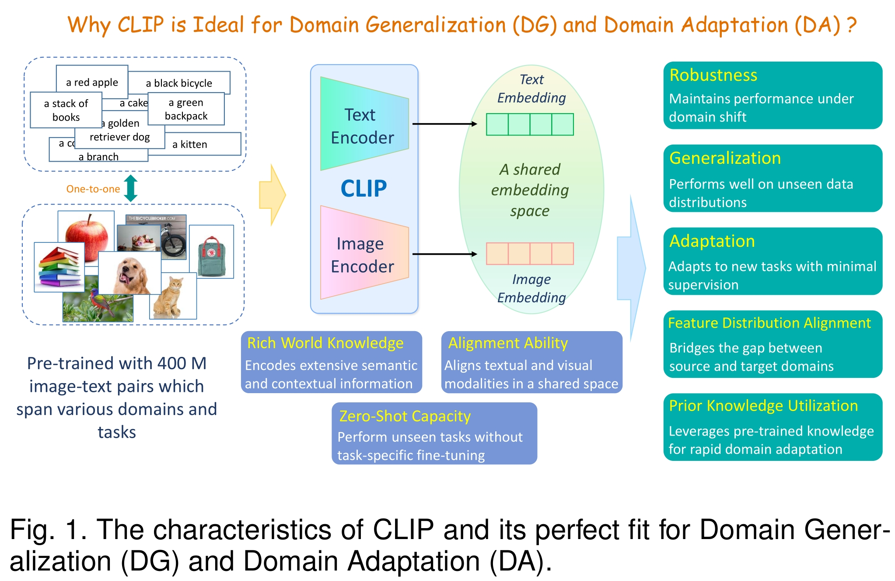
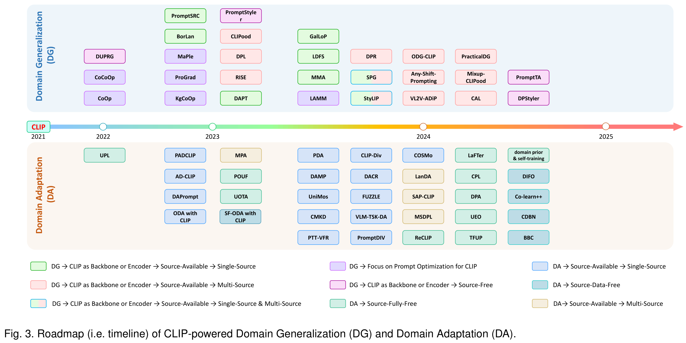
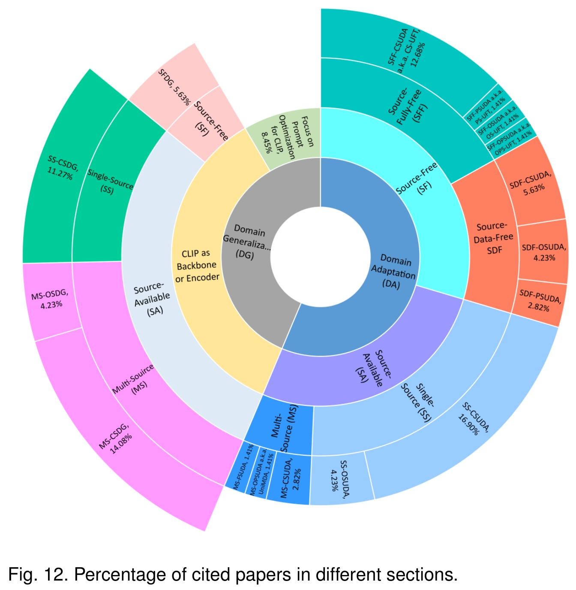

<div align="center">
    <h1><b>CLIP-Powered Domain Generalization and Domain Adaptation: A Comprehensive Survey</b></h1>
</div>

The official GitHub page for the survey paper "CLIP-Powered Domain Generalization and Domain Adaptation: A Comprehensive Survey".


<div align="center">


<a href="https://arxiv.org/abs/2504.14280" target="_blank"></a>

</div>


<div align="center">
[arXiv][https://arxiv.org/abs/2504.14280]
</div>
<div align="center">
[机器之心][https://www.jiqizhixin.com/articles/2025-05-06-5]
</div>


<br>
<br>
<p align="center">
    
</p>
<br>


1. 2021_ICML_CLIP_Learning Transferable Visual Models From Natural Language Supervision.

    [[ICML]](https://icml.cc/virtual/2021/oral/9194)
    [[arXiv]](https://arxiv.org/abs/2103.00020)
    [[GitHub]](https://github.com/OpenAI/CLIP)


## 1. Introduction


<p align="center">
    
</p>
<br>
<br>

<p align="center">
    
</p>
<br>
<br>


<p align="center">
    
</p>
<br>
<br>


<p align="center">
    
</p>
<br>


## 2. Preliminaries


<p align="center">
    
</p>
<br>
<br>


<p align="center">
    
</p>
<br>
<br>


<p align="center">
    
</p>
<br>
<br>


<p align="center">
    
</p>
<br>


<p align="center">
    
</p>
<br>


## 3. Domain Generalization

### 3.1 Prompt Optimization Techniques

<p align="center">
    
</p>
<br>

1. 2022_CVPR_CoCoOp_Conditional Prompt Learning for Vision-Language Models.

    [[CVPR]](https://openaccess.thecvf.com/content/CVPR2022/html/Zhou_Conditional_Prompt_Learning_for_Vision-Language_Models_CVPR_2022_paper.html)
    [[arXiv]](https://arxiv.org/abs/2203.05557)
    [[GitHub]](https://github.com/KaiyangZhou/CoOp)

2. 2022_IJCV_CoOp_Learning to Prompt for Vision-Language Models.

    [[ACM]](https://dl.acm.org/doi/abs/10.1007/s11263-022-01653-1)
    [[Springer]](https://link.springer.com/article/10.1007/s11263-022-01653-1)
    [[arXiv]](https://arxiv.org/abs/2109.01134)
    [[GitHub]](https://github.com/KaiyangZhou/CoOp)
   
3. 2023_CVPR_KgCoOp_Visual-Language Prompt Tuning with Knowledge-Guided Context Optimization.

    [[CVPR]](https://openaccess.thecvf.com/content/CVPR2023/html/Yao_Visual-Language_Prompt_Tuning_With_Knowledge-Guided_Context_Optimization_CVPR_2023_paper.html)
    [[arXiv]](https://arxiv.org/abs/2303.13283)
    [[GitHub]](https://github.com/htyao89/KgCoOp)
   
4. 2023_CVPR_MaPLe_MaPLe: Multi-Modal Prompt Learning.

    [[CVPR]](https://openaccess.thecvf.com/content/CVPR2023/html/Khattak_MaPLe_Multi-Modal_Prompt_Learning_CVPR_2023_paper.html)
    [[IEEE]](https://ieeexplore.ieee.org/document/10203359)
    [[arXiv]](https://arxiv.org/abs/2210.03117)
    [[GitHub]](https://github.com/muzairkhattak/multimodal-prompt-learning)
   
5. 2023_ICCV_ProGrad_Prompt-aligned Gradient for Prompt Tuning.

    [[ICCV]](https://openaccess.thecvf.com/content/ICCV2023/html/Zhu_Prompt-aligned_Gradient_for_Prompt_Tuning_ICCV_2023_paper.html)
    [[IEEE]](https://ieeexplore.ieee.org/abstract/document/10378362)
    [[arXiv]](https://arxiv.org/abs/2205.14865)
    [[GitHub]](https://github.com/BeierZhu/Prompt-align)

6. 2024_AAAI_LAMM_LAMM: Label Alignment for Multi-Modal Prompt Learning.

    [[AAAI]](https://ojs.aaai.org/index.php/AAAI/article/view/27950)
    [[arXiv]](https://arxiv.org/abs/2312.08212)
    [[GitHub]](https://github.com/gaojingsheng/LAMM)
    
    

### 3.2 CLIP is Adopted as Backbone or Encoder

<p align="center">
    
</p>
<br>


#### 3.2.1 Source-Available (SA)
##### 3.2.1.1 Single-Source Closed-Set Domain Generalization (SS-CSDG)

1. 2023_ICCV_BorLan_Borrowing Knowledge From Pre-trained Language Model: A New Data-efficient Visual Learning Paradigm.

    [[ICCV]](https://openaccess.thecvf.com/content/ICCV2023/html/Ma_Borrowing_Knowledge_From_Pre-trained_Language_Model_A_New_Data-efficient_Visual_ICCV_2023_paper.html)
    [[IEEE]](https://ieeexplore.ieee.org/document/10377230)
    [[GitHub]](https://github.com/BIT-DA/BorLan)

2. 2023_ICCV_DAPT_Distribution-Aware Prompt Tuning for Vision-Language Models.

    [[ICCV]](https://openaccess.thecvf.com/content/ICCV2023/html/Cho_Distribution-Aware_Prompt_Tuning_for_Vision-Language_Models_ICCV_2023_paper.html)
    [[arXiv]](https://arxiv.org/abs/2309.03406)
    [[GitHub]](https://github.com/mlvlab/DAPT)
    [[GitHub 2]](https://github.com/guspan-tanadi/DAPTbymlvlab)

3. 2023_ICCV_PromptSRC_Self-Regulating Prompts: Foundational Model Adaptation without Forgetting.

    [[ICCV]](https://openaccess.thecvf.com/content/ICCV2023/html/Khattak_Self-regulating_Prompts_Foundational_Model_Adaptation_without_Forgetting_ICCV_2023_paper.html)
    [[IEEE]](https://ieeexplore.ieee.org/abstract/document/10376701)
    [[GitHub]](https://github.com/muzairkhattak/PromptSRC)

4. 2024_ECCV_GalLoP_GalLoP: Learning Global and Local Prompts for Vision-Language Models.

    [[ECCV]](https://link.springer.com/chapter/10.1007/978-3-031-73030-6_15)
    [[arXiv]](https://arxiv.org/abs/2407.01400v1)
    [[GitHub]](https://github.com/MarcLafon/gallop)

5. 2024_arXiv_LDFS_Enhancing Vision-Language Models Generalization via Diversity-Driven Novel Feature Synthesis.

    [[arXiv]](https://arxiv.org/abs/2405.02586)

6. 2024_ECCV_SPG_Soft Prompt Generation for Domain Generalization.

    [[ECCV]](https://link.springer.com/chapter/10.1007/978-3-031-72646-0_25)
    [[arXiv]](https://arxiv.org/abs/2404.19286)
    [[GitHub]](https://github.com/renytek13/Soft-Prompt-Generation)

7. 2024_CVPR_MMA_MMA: Multi-Modal Adapter for Vision-Language Models.

    [[CVPR]](https://openaccess.thecvf.com/content/CVPR2024/html/Yang_MMA_Multi-Modal_Adapter_for_Vision-Language_Models_CVPR_2024_paper.html)
    [[IEEE]](https://ieeexplore.ieee.org/abstract/document/10655598)
    [[GitHub]](https://github.com/ZjjConan/VLM-MultiModalAdapter)

8. 2024_WACV_StyLIP_StyLIP: Multi-Scale Style-Conditioned Prompt Learning for CLIP-based Domain Generalization.

    [[WACV]](https://openaccess.thecvf.com/content/WACV2024/html/Bose_STYLIP_Multi-Scale_Style-Conditioned_Prompt_Learning_for_CLIP-Based_Domain_Generalization_WACV_2024_paper.html)
    [[arXiv]](https://arxiv.org/abs/2302.09251)


##### 3.2.1.2 Multi-Source Closed-Set Domain Generalization (MS-CSDG)

1. 2023_ICCV_RISE_A Sentence Speaks a Thousand Images: Domain Generalization through Distilling CLIP with Language Guidance.

    [[ICCV]](https://openaccess.thecvf.com/content/ICCV2023/html/Huang_A_Sentence_Speaks_a_Thousand_Images_Domain_Generalization_through_Distilling_ICCV_2023_paper.html)
    [[IEEE]](https://ieeexplore.ieee.org/abstract/document/10378073)
    [[arXiv]](http://export.arxiv.org/abs/2309.12530)
   
2. 2023_TJSAI_DPL_Domain Prompt Learning for Efficiently Adapting CLIP to Unseen Domains.

    [[Jstage]](https://www.jstage.jst.go.jp/article/tjsai/38/6/38_38-6_B-MC2/_pdf)
    [[GitHub]](https://github.com/anonymous-2023/DPLCLIP)

3. 2024_arXiv_SPG_Soft Prompt Generation for Domain Generalization.

    [[ECCV]](https://link.springer.com/chapter/10.1007/978-3-031-72646-0_25)
    [[arXiv]](https://arxiv.org/abs/2404.19286)
    [[GitHub]](https://github.com/renytek13/Soft-Prompt-Generation)

4. 2024_Access_CAL_Consistent Augmentation Learning for Generalizing CLIP to Unseen Domains.

    [[IEEE]](https://ieeexplore.ieee.org/stamp/stamp.jsp?arnumber=10716475)
    
5. 2024_AIEA_Mix-up Loss_Robust Domain Generalization for Multi-modal Object Recognition.

    [[IEEE]](https://ieeexplore.ieee.org/abstract/document/10692575)
    [[arXiv]](https://arxiv.org/abs/2408.05831)
   
6. 2024_CVPR_Any-Shift Prompting_Any-Shift Prompting for Generalization over Distributions.

    [[CVPR]](https://openaccess.thecvf.com/content/CVPR2024/html/Xiao_Any-Shift_Prompting_for_Generalization_over_Distributions_CVPR_2024_paper.html)
    [[IEEE]](https://ieeexplore.ieee.org/abstract/document/10655908)
    [[arXiv]](https://arxiv.org/abs/2402.10099)
    [[GitHub]](https://github.com/zzzx1224/any-shift-prompting/tree/main)
    
7. 2024_CVPR_DPR_Disentangled Prompt Representation for Domain Generalization.\

    [[CVPR]](https://openaccess.thecvf.com/content/CVPR2024/html/Cheng_Disentangled_Prompt_Representation_for_Domain_Generalization_CVPR_2024_paper.html)
    [[IEEE]](https://ieeexplore.ieee.org/abstract/document/10655401)
   
8. 2024_CVPR_ODG-CLIP_Unknown Prompt, the only Lacuna: Unveiling CLIP’s Potential for Open Domain Generalization.

    [[CVPR]](https://openaccess.thecvf.com/content/CVPR2024/html/Singha_Unknown_Prompt_the_only_Lacuna_Unveiling_CLIPs_Potential_for_Open_CVPR_2024_paper.html)
    [[IEEE]](https://ieeexplore.ieee.org/abstract/document/10655065)
    [[arXiv]](https://arxiv.org/abs/2404.00710)
    [[GitHub]](https://github.com/mainaksingha01/ODG-CLIP)
    
9. 2024_CVPR_VL2V-ADiP_Leveraging Vision-Language Models for Improving Domain Generalization in Image Classification.

    [[CVPR]](https://openaccess.thecvf.com/content/CVPR2024/html/Addepalli_Leveraging_Vision-Language_Models_for_Improving_Domain_Generalization_in_Image_Classification_CVPR_2024_paper.html)
    [[IEEE]](https://ieeexplore.ieee.org/abstract/document/10655259)
    [[arXiv]](https://arxiv.org/abs/2310.08255)
    [[Homepage]](http://val.cds.iisc.ac.in/VL2V-ADiP/)
    [[GitHub]](https://github.com/val-iisc/VL2V-ADiP)

10. 2024_WACV_StyLIP_StyLIP: Multi-Scale Style-Conditioned Prompt Learning for CLIP-based Domain Generalization.

    [[WACV]](https://openaccess.thecvf.com/content/WACV2024/html/Bose_STYLIP_Multi-Scale_Style-Conditioned_Prompt_Learning_for_CLIP-Based_Domain_Generalization_WACV_2024_paper.html)
    [[IEEE]](https://ieeexplore.ieee.org/abstract/document/10484142)
    [[arXiv]](https://arxiv.org/abs/2302.09251)

11. 2025_CVPR_Diverse-Text-Prompts_Domain Generalization in CLIP via Learing with Diverse Text Prompts.

    [[CVPR]](https://openaccess.thecvf.com/content/CVPR2025/html/Wen_Domain_Generalization_in_CLIP_via_Learning_with_Diverse_Text_Prompts_CVPR_2025_paper.html)
    [[IEEE]](https://ieeexplore.ieee.org/document/11093286/similar#similar)


##### 3.2.1.3 Multi-Source Open-Set Domain Generalization (MS-OSDG)

1. 2023_ICML_CLIPood_CLIPood: Generalizing CLIP to Out-of-Distributions.

    [[ICML]](https://proceedings.mlr.press/v202/shu23a/shu23a.pdf)
    [[GitHub]](https://github.com/thuml/CLIPood)

2. 2024_CVPR_ODG-CLIP_Unknown Prompt, the only Lacuna: Unveiling CLIP’s Potential for Open Domain Generalization.

    [[CVPR]](https://openaccess.thecvf.com/content/CVPR2024/papers/Singha_Unknown_Prompt_the_only_Lacuna_Unveiling_CLIPs_Potential_for_Open_CVPR_2024_paper.pdf)
    [[GitHub]](https://github.com/mainaksingha01/ODG-CLIP)
   
3. 2024_CVPR_SCI-PD_PracticalDG: Perturbation Distillation on Vision-Language Models for Hybrid Domain Generalization.

    [[CVPR]](https://openaccess.thecvf.com/content/CVPR2024/papers/Chen_PracticalDG_Perturbation_Distillation_on_Vision-Language_Models_for_Hybrid_Domain_Generalization_CVPR_2024_paper.pdf)
    [[GitHub]](https://github.com/znchen666/HDG)

4. 2025_TMLR_MetaPrompt_Meta-Learning to Teach Semantic Prompts for Open Domain Generalization in Vision-Language Models.

   [[OpenReview]](https://scholar.google.com/scholar?hl=zh-CN&as_sdt=0%2C5&q=Meta-Learning+to+Teach+Semantic+Prompts+for+Open+Domain+Generalization+in+Vision-Language+Models&btnG=)


#### 3.2.2 Source-Free (SF)
##### Source(-Fully)-Free Domain Generalization (S(F)F-DG)

1. 2022_arXiv_DUPRG_Domain-Unified Prompt Representations for Source-Free Domain Generalization.

    [[arXiv]](https://arxiv.org/abs/2209.14926)
    [[GitHub]](https://github.com/muse1998/Source-Free-Domain-Generalization)

2. 2023_ICCV_PromptStyler_PromptStyler: Prompt-driven Style Generation for Source-free Domain Generalization.

    [[ICCV]](https://openaccess.thecvf.com/content/ICCV2023/html/Cho_PromptStyler_Prompt-driven_Style_Generation_for_Source-free_Domain_Generalization_ICCV_2023_paper.html)
    [[IEEE]](https://ieeexplore.ieee.org/abstract/document/10377071)
    [[arXiv]](https://arxiv.org/abs/2307.15199)
    [[GitHub]](https://github.com/PromptStyler/PromptStyler.github.io)

3. 2024_arXiv_2025_ToM_DPStyler_DPStyler: Dynamic PromptStyler for Source-Free Domain Generalization.

    [[arXiv]](https://arxiv.org/abs/2403.16697)
    [[ToM]](https://ieeexplore.ieee.org/abstract/document/10824918)
    [[ACM]](https://dl.acm.org/doi/abs/10.1109/TMM.2024.3521671)
    [[GitHub]](https://github.com/TYLfromSEU/DPStyler)

4. 2024_arXiv_2025_ICASSP_PromptTA_PromptTA: Prompt-driven Text Adapter for Source-free Domain Generalization.

    [[arXiv]](https://arxiv.org/abs/2409.14163)
    [[ICASSP]](https://ieeexplore.ieee.org/abstract/document/10888057)
    [[GitHub]](https://github.com/zhanghr2001/PromptTA)


## 4. Domain Adaptation

### 4.1 Source-Available (SA)

#### 4.1.1 Single-Source (SS)

##### 4.1.1.1 Single-Source Closed-Set Unsupervised Domain Adaptation (SS-CSUDA)

1. 2023_ICCV_PADCLIP_PADCLIP: Pseudo-labeling with Adaptive Debiasing in CLIP for Unsupervised Domain Adaptation.

    [[ICCV]](https://openaccess.thecvf.com/content/ICCV2023/html/Lai_PADCLIP_Pseudo-labeling_with_Adaptive_Debiasing_in_CLIP_for_Unsupervised_Domain_ICCV_2023_paper.html)
    [[IEEE]](https://ieeexplore.ieee.org/document/10377727)

2. 2023_ICCVW_AD-CLIP_AD-CLIP: Adapting Domains in Prompt Space Using CLIP.

    [[ICCV]](https://openaccess.thecvf.com/content/ICCV2023W/OODCV/html/Singha_AD-CLIP_Adapting_Domains_in_Prompt_Space_Using_CLIP_ICCVW_2023_paper.html)
    [[IEEE]](https://ieeexplore.ieee.org/document/10351000)
    [[arXiv]](https://arxiv.org/abs/2308.05659)
    [[GitHub]](https://github.com/mainaksingha01/AD-CLIP/tree/master)

3. 2023_TNNLS_DAPrompt_Domain Adaptation via Prompt Learning.

    [[IEEE]](https://ieeexplore.ieee.org/document/10313995)
    [[arXiv]](https://arxiv.org/abs/2202.06687)
    [[GitHub]](https://github.com/LeapLabTHU/DAPrompt)

4. 2024_arXiv_CLIP-Div_CLIP the Divergence: Language-guided Unsupervised Domain Adaptation.

    [[arXiv]](https://arxiv.org/abs/2407.01842)

5. 2024_AAAI_PDA_Prompt-based Distribution Alignment for Unsupervised Domain Adaptation.

    [[AAAI]](https://ojs.aaai.org/index.php/AAAI/article/view/27830)
    [[arXiv]](https://arxiv.org/abs/2312.09553v1)
    [[GitHub]](https://github.com/BaiShuanghao/Prompt-based-Distribution-Alignment)

6. 2024_CVPR_DAMP_Domain-Agnostic Mutual Prompting for Unsupervised Domain Adaptation.

    [[CVPR]](https://openaccess.thecvf.com/content/CVPR2024/html/Du_Domain-Agnostic_Mutual_Prompting_for_Unsupervised_Domain_Adaptation_CVPR_2024_paper.html)
    [[IEEE]](https://ieeexplore.ieee.org/abstract/document/10658604)
    [[arXiv]](https://arxiv.org/abs/2403.02899)
    [[GitHub]](https://github.com/TL-UESTC/DAMP)

7. 2024_CVPR_UniMoS_Split to Merge: Unifying Separated Modalities for Unsupervised Domain Adaptation.

    [[CVPR]](https://openaccess.thecvf.com/content/CVPR2024/html/Li_Split_to_Merge_Unifying_Separated_Modalities_for_Unsupervised_Domain_Adaptation_CVPR_2024_paper.html)
    [[IEEE]](https://ieeexplore.ieee.org/abstract/document/10656339)
    [[arXiv]](https://arxiv.org/abs/2403.06946v1)
    [[GitHub]](https://github.com/TL-UESTC/UniMoS)

8. 2024_FUZZ-IEEE_VLM-TSK-DA_Enhancing Vision-Language Models Incorporating TSK Fuzzy System for Domain Adaptation.

    [[IEEE]](https://ieeexplore.ieee.org/abstract/document/10612077)
   
9. 2024_IJCNN_DACR_CLIP-Enhanced Unsupervised Domain Adaptation with Consistency Regularization.

    [[IEEE]](https://ieeexplore.ieee.org/abstract/document/10650901)

10. 2024_TCSVT_CMKD_Unsupervised Domain Adaption Harnessing Vision-Language Pre-training.

    [[IEEE]](https://ieeexplore.ieee.org/abstract/document/10505301)
    [[ACM]](https://dl.acm.org/doi/abs/10.1109/TCSVT.2024.3391304)
    [[arXiv]](https://arxiv.org/abs/2408.02192)
    [[GitHub]](https://github.com/Wenlve-Zhou/VLP-UDA)

11. 2024_TOFS_FUZZLE_Unsupervised Domain Adaptation Enhanced by Fuzzy Prompt Learning.

    [[IEEE]](https://ieeexplore.ieee.org/abstract/document/10502168)
    [[ACM]](https://dl.acm.org/doi/abs/10.1109/TFUZZ.2024.3389705)

12. 2024_WACV_PTT-VFR_Empowering Unsupervised Domain Adaptation with Large-scale Pre-trained Vision-Language Models.

    [[WACV]](https://openaccess.thecvf.com/content/WACV2024/papers/Lai_Empowering_Unsupervised_Domain_Adaptation_With_Large-Scale_Pre-Trained_Vision-Language_Models_WACV_2024_paper.pdf)
    [[IEEE]](https://ieeexplore.ieee.org/document/10484237)


13. 2025_IJCV_MAwLLM_Multi-modal Prompt Alignment with Fine-grained LLM Knowledge for Unsupervised Domain Adaptation.
    
    [[Springer]](https://link.springer.com/article/10.1007/s11263-025-02497-1)
    

14. 2025_KBS_PDBDa_PDbDa: Prompt-Tuned Dual-Branch Framework for Unsupervised Domain Adaptation.

    [[Elsevier]](https://www.sciencedirect.com/science/article/pii/S0950705125015485)


15. 2025_TIP_ADAPT_When Adversarial Training Meets Prompt Tuning: Adversarial Dual Prompt Tuning for Unsupervised Domain Adaptation.

    [[ACM]](https://dl.acm.org/doi/abs/10.1109/TIP.2025.3541868)
    [[IEEE]](https://ieeexplore.ieee.org/abstract/document/10901852)
    [[GitHub]](https://github.com/Liuziyi1999/ADAPT)


##### 4.1.1.2 Single-Source Open-Set Unsupervised Domain Adaptation (SS-OSUDA)

1. 2023_arXiv_2025_CVIU_ODA with CLIP_Open-Set Domain Adaptation with Visual-Language Foundation Models.

    [[ScienceDirect CVIU]](https://www.sciencedirect.com/science/article/pii/S1077314224003114)
    [[ACM]](https://dl.acm.org/doi/abs/10.1016/j.cviu.2024.104230)
    [[arXiv]](https://arxiv.org/abs/2307.16204)

2. 2024_arXiv_COSMo_COSMo: CLIP Talks on Open-Set Multi-Target Domain Adaptation.

    [[arXiv]](https://arxiv.org/abs/2409.00397v1)
    [[GitHub]](https://github.com/munish30monga/COSMo)

3. 2024_ICIP_PromptIDIV_Decoupling Domain Invariance and Variance With Tailored Prompts for Open-Set Domain Adaptation.

    [[IEEE]](https://ieeexplore.ieee.org/document/10647719)


#### 4.1.2 Multi-Source (MS)

##### 4.1.2.1 Multi-Source Closed-Set Unsupervised Domain Adaptation (MS-CSUDA)

1. 2023_NeurIPS_MPA_Multi-Prompt Alignment for Multi-Source Unsupervised Domain Adaptation.

    [[NeurIPS]](https://proceedings.neurips.cc/paper_files/paper/2023/hash/eadeef7c51ad86989cc3b311cb49ec89-Abstract-Conference.html)
    [[ACM]](https://dl.acm.org/doi/abs/10.5555/3666122.3669365)
    [[arXiv]](https://arxiv.org/abs/2209.15210)
    [[GitHub]](https://github.com/HaoranChen/Multi-Prompt-Alignment-for-MSUDA)
   
2. 2024_arXiv_LanDA_LanDA: Language-Guided Multi-Source Domain Adaptation.

    [[arXiv]](https://arxiv.org/abs/2401.14148)
    [[GitHub]](https://github.com/wongzbb/LanDA)

3. 2025_CVPR_CRPL_Preserving Clusters in Prompt Learning for Unsupervised Domain Adaptation.

    [[CVPR]](https://openaccess.thecvf.com/content/CVPR2025/html/Vuong_Preserving_Clusters_in_Prompt_Learning_for_Unsupervised_Domain_Adaptation_CVPR_2025_paper.html)
    [[arXiv]](https://arxiv.org/abs/2506.11493)


##### 4.1.2.2 Multi-Source Open-Partial-Set Unsupervised Domain Adaptation (MS-OPSUDA) a.k.a. Universal Multi-Source Domain Adaptation (UniMDA)

1. 2024_Signal Processing Letters_SAP-CLIP_Semantic-Aware Adaptive Prompt Learning for Universal Multi-Source Domain Adaptation.

    [[IEEE]](https://ieeexplore.ieee.org/document/10502133)


##### 4.1.2.3 Multi-Source Few-Shot Domain Adaptation (MS-FSDA)

1. 2024_OpenReview_MSDPL_Domain Prompt Matters a Lot in Multi-Source Few-Shot Domain Adaptation.

    [[OpenReview]](https://openreview.net/forum?id=YRJDZYGmAZ)


### 4.2 Source-Free (SF)

#### 4.2.1 Source-Fully-Free (SFF)

##### 4.2.1.1 Source-Fully-Free Closed-Set Unsupervised Domain Adaptation (SFF-CSUDA) a.k.a. Unsupervised Fine-Tuning (CS-UFT)

1. 2022_arXiv_UPL_Unsupervised Prompt Learning for Vision-Language Models.

    [[arXiv]](https://arxiv.org/abs/2204.03649)
    [[GitHub]](https://github.com/tonyhuang2022/UPL)

2. 2023_ICML_POUF_POUF: Prompt-oriented unsupervised fine-tuning for large pre-trained models.

    [[PMLR]](https://proceedings.mlr.press/v202/tanwisuth23a.html)
    [[ACM]](https://dl.acm.org/doi/abs/10.5555/3618408.3619817)
    [[arXiv]](https://arxiv.org/abs/2305.00350)
    [[GitHub]](https://github.com/korawat-tanwisuth/POUF)

3. 2024_arXiv_2025_WACV_DPA_DPA: Dual Prototypes Alignment for Unsupervised Adaptation of Vision-Language Models.

    [[WACV]](https://ieeexplore.ieee.org/abstract/document/10943951)
    [[IEEE]](https://ieeexplore.ieee.org/abstract/document/10943951)
    [[arXiv]](https://arxiv.org/abs/2408.08855)
    [[GitHub]](https://github.com/Externalhappy/DPA)

4. 2024_arXiv_TFUP_Training-Free Unsupervised Prompt for Vision-Language Models.

    [[arXiv]](https://arxiv.org/abs/2404.16339)
    [[GitHub]](https://github.com/wlb12345/TFUP)

5. 2024_ICIP_Rethinking Domain Adaptation and Generalization in the Era Of CLIP.

    [[IEEE]](https://ieeexplore.ieee.org/abstract/document/10647766)
    [[arXiv]](https://arxiv.org/abs/2407.15173)

6. 2024_ICML_CPL_Candidate Pseudolabel Learning: Enhancing Vision-Language Models by Prompt Tuning with Unlabeled Data.

    [[PMLR]](https://proceedings.mlr.press/v235/zhang24bo.html)
    [[ACM]](https://dl.acm.org/doi/abs/10.5555/3692070.3694551)
    [[arXiv]](https://arxiv.org/abs/2406.10502)
    [[GitHub]](https://github.com/vanillaer/CPL-ICML2024)
    [[Slides]](https://icml.cc/media/icml-2024/Slides/32922.pdf)

7. 2024_ICML_UEO_Realistic Unsupervised CLIP Fine-tuning with Universal Entropy Optimization.

    [[PMLR]](https://proceedings.mlr.press/v235/liang24e.html)
    [[ACM]](https://dl.acm.org/doi/abs/10.5555/3692070.3693265)
    [[arXiv]](https://arxiv.org/abs/2308.12919)
    [[GitHub]](https://github.com/tim-learn/UEO)

8. 2024_NeurIPS_LaFTer_LaFTer: Label-Free Tuning of Zero-shot Classifier using Language and Unlabeled Image Collections.

    [[NeurIPS]](https://proceedings.neurips.cc/paper_files/paper/2023/hash/123a18dfd821c8b440f42a00a27648d6-Abstract-Conference.html)
    [[ACM]](https://dl.acm.org/doi/abs/10.5555/3666122.3666374)
    [[arXiv]](https://arxiv.org/abs/2305.18287)
    [[Homepage]](https://jmiemirza.github.io/LaFTer/)
    [[GitHub]](https://github.com/jmiemirza/LaFTer)

9. 2024_WACV_ReCLIP_ReCLIP: Refine Contrastive Language Image Pre-Training with Source Free Domain Adaptation.

    [[WACV]](https://openaccess.thecvf.com/content/WACV2024/html/Hu_ReCLIP_Refine_Contrastive_Language_Image_Pre-Training_With_Source_Free_Domain_WACV_2024_paper.html)
    [[IEEE]](https://ieeexplore.ieee.org/abstract/document/10483866)
    [[arXiv]](https://arxiv.org/abs/2308.03793)
    [[GitHub]](https://github.com/michiganleon/ReCLIP_WACV)


##### 4.2.1.2 Source-Fully-Free Partial-Set Unsupervised Domain Adaptation (SFF-PSUDA) a.k.a. Partial-Set Unsupervised Fine-Tuning (PS-UFT)

1. 2024_ICML_UEO_Realistic Unsupervised CLIP Fine-tuning with Universal Entropy Optimization.

    [[PMLR]](https://proceedings.mlr.press/v235/liang24e.html)
    [[ACM]](https://dl.acm.org/doi/abs/10.5555/3692070.3693265)
    [[arXiv]](https://arxiv.org/abs/2308.12919)
    [[GitHub]](https://github.com/tim-learn/UEO)


##### 4.2.1.3 Source-Fully-Free Open-Set Unsupervised Domain Adaptation (SFF-OSUDA) a.k.a. Open-Set Unsupervised Fine-Tuning (OS-UFT)

1. 2023_ICML Workshop_UOTA_UOTA: Unsupervised Open-Set Task Adaptation Using a Vision-Language Foundation Model.

    [[ICML]](https://icml.cc/virtual/2023/28284)

2. 2024_ICML_UEO_Realistic Unsupervised CLIP Fine-tuning with Universal Entropy Optimization.

    [[PMLR]](https://proceedings.mlr.press/v235/liang24e.html)
    [[ACM]](https://dl.acm.org/doi/abs/10.5555/3692070.3693265)
    [[arXiv]](https://arxiv.org/abs/2308.12919)
    [[GitHub]](https://github.com/tim-learn/UEO)

3. 2025_arXiv_CLIPXpert_Revisiting CLIP for SF-OSDA= Unleashing Zero-Shot Potential with Adaptive Threshold and Training-Free Feature Filtering.

    [[arXiv]](https://arxiv.org/abs/2504.14224)


##### 4.2.1.4 Source-Fully-Free Open-Partial-Set Unsupervised Domain Adaptation (SFF-OPSUDA) a.k.a Open-Partial-Set Unsupervised Fine-Tuning (OPS-UFT)

1. 2024_ICML_UEO_Realistic Unsupervised CLIP Fine-tuning with Universal Entropy Optimization.

    [[PMLR]](https://proceedings.mlr.press/v235/liang24e.html)
    [[ACM]](https://dl.acm.org/doi/abs/10.5555/3692070.3693265)
    [[arXiv]](https://arxiv.org/abs/2308.12919)
    [[GitHub]](https://github.com/tim-learn/UEO)


#### 4.2.2 Source-Data-Free (SDF)

##### 4.2.2.1 Source-Data-Free Closed-Set Unsupervised Domain Adaptation (SDF-CSUDA)

1. 2024_arXiv_CDBN_Data-Efficient CLIP-Powered Dual-Branch Networks for Source-Free Unsupervised Domain Adaptation.

    [[arXiv]](https://arxiv.org/abs/2410.15811)
    [[GitHub]](https://github.com/ethanAiJLu/CDBN)

2. 2024_CVPR_DIFO_Source-Free Domain Adaptation with Frozen Multimodal Foundation Model.

    [[CVPR]](https://openaccess.thecvf.com/content/CVPR2024/html/Tang_Source-Free_Domain_Adaptation_with_Frozen_Multimodal_Foundation_Model_CVPR_2024_paper.html)
    [[IEEE]](https://ieeexplore.ieee.org/document/10654933)
    [[arXiv]](https://arxiv.org/abs/2311.16510)
    [[GitHub]](https://github.com/tntek/source-free-domain-adaptation)

3. 2024_IJCV_Co-learn++_Source-Free Domain Adaptation Guided by Vision and Vision-Language Pre-Training.

    [[Springer]](https://link.springer.com/article/10.1007/s11263-024-02215-3)
    [[ACM]](https://dl.acm.org/doi/abs/10.1007/s11263-024-02215-3)
    [[arXiv]](https://arxiv.org/abs/2405.02954)
    [[GitHub]](https://github.com/zwenyu/colearn-plus)

4. 2024_Signal-Image-and-Video-Processing_BBC_CLIP-guided Black-Box Domain Adaptation of Image Classification.

    [[Springer]](https://link.springer.com/article/10.1007/s11760-024-03101-8)
    [[OpenReview]](https://openreview.net/forum?id=v5wjwljhc2)

5. 2025_ICLR_Prode_Proxy Denoising for Source-Free Domain Adaptation.

    [[OpenReview]](https://openreview.net/forum?id=FIj9IEPCKr)
    [[arXiv]](https://arxiv.org/abs/2406.01658v3)
    [[Slides]](https://iclr.cc/media/iclr-2025/Slides/30349.pdf)
    [[GitHub]](https://github.com/tntek/source-free-domain-adaptation)


##### 4.2.2.2 Source-Data-Free Partial-Set Unsupervised Domain Adaptation (SDF-PSUDA)

1. 2024_CVPR_DIFO_Source-Free Domain Adaptation with Frozen Multimodal Foundation Model.

    [[CVPR]](https://openaccess.thecvf.com/content/CVPR2024/html/Tang_Source-Free_Domain_Adaptation_with_Frozen_Multimodal_Foundation_Model_CVPR_2024_paper.html)
    [[IEEE]](https://ieeexplore.ieee.org/document/10654933)
    [[arXiv]](https://arxiv.org/abs/2311.16510)
    [[GitHub]](https://github.com/tntek/source-free-domain-adaptation)

2. 2024_IJCV_Co-learn++_Source-Free Domain Adaptation Guided by Vision and Vision-Language Pre-Training.

    [[Springer]](https://link.springer.com/article/10.1007/s11263-024-02215-3)
    [[ACM]](https://dl.acm.org/doi/abs/10.1007/s11263-024-02215-3)
    [[arXiv]](https://arxiv.org/abs/2405.02954)
    [[GitHub]](https://github.com/zwenyu/colearn-plus)


##### 4.2.2.3 Source-Data-Free Open-Set Unsupervised Domain Adaptation (SDF-OSUDA)

1. 2023_arXiv_2025_CVIU_ODA with CLIP_Open-Set Domain Adaptation with Visual-Language Foundation Models.

    [[ScienceDirect CVIU]](https://www.sciencedirect.com/science/article/pii/S1077314224003114)
    [[ACM]](https://dl.acm.org/doi/abs/10.1016/j.cviu.2024.104230)
    [[arXiv]](https://arxiv.org/abs/2307.16204)

2. 2024_CVPR_DIFO_Source-Free Domain Adaptation with Frozen Multimodal Foundation Model.

    [[CVPR]](https://openaccess.thecvf.com/content/CVPR2024/html/Tang_Source-Free_Domain_Adaptation_with_Frozen_Multimodal_Foundation_Model_CVPR_2024_paper.html)
    [[IEEE]](https://ieeexplore.ieee.org/document/10654933)
    [[arXiv]](https://arxiv.org/abs/2311.16510)
    [[GitHub]](https://github.com/tntek/source-free-domain-adaptation)

3. 2024_IJCV_Co-learn++_Source-Free Domain Adaptation Guided by Vision and Vision-Language Pre-Training.

    [[Springer]](https://link.springer.com/article/10.1007/s11263-024-02215-3)
    [[ACM]](https://dl.acm.org/doi/abs/10.1007/s11263-024-02215-3)
    [[arXiv]](https://arxiv.org/abs/2405.02954)
    [[GitHub]](https://github.com/zwenyu/colearn-plus)


<p align="center">
    
</p>
<br>


<p align="center">
    
</p>
<br>


<p align="center">
    
</p>
<br>


<!--

<table>
  <thead>
    <tr>
      <th rowspan="3", colspan='3'>Scenario</th>
      <th colspan="3">Pre-train in Source Domain</th>
      <th colspan="2">Adapt in Target Domain</th>
      <th colspan="4">Category between Source Domain and Target Domain</th>
    </tr>
    <tr>
      <th colspan='2'>Source Domain</th>
      <th rowspan='2'>Target Domain</th>
      <th rowspan='2'>Source Domain Data</th>
      <th rowspan='2'>Source Domain Knowledge</th>
      <th rowspan='2'>Closed-Set</th>
      <th rowspan='2'>Partial-Set</th>
      <th rowspan='2'>Open-Set</th>
      <th rowspan='2'>Open-Partial-Set</th>
    </tr>
    <tr>
      <th>Single-Source</th>
      <th>Multi-Souirce</th>
    </tr>
  </thead>
  <tbody>
    <tr>
      <td rowspan="4">DG</td>
      <td rowspan='3'>Source-Available (SA)</td>
      <td>Single-Source Domain Generalization (SS-DG)</td>
      <td>✅</td>
      <td></td>
      <td></td>
      <td></td>
      <td></td>
      <td>✅</td>
      <td>✅</td>
      <td>✅</td>
      <td></td>
    </tr>
    <tr>
      <td>Multi-Source Closed-Set Domain Generalization (MS-CSDG)</td>
      <td></td>
      <td>✅</td>
      <td></td>
      <td></td>
      <td></td>
      <td>✅</td>
      <td></td>
      <td></td>
      <td></td>
    </tr>
    <tr>
      <td>Multi-Source Domain Open-Set Generalization (MS-OSDG)</td>
      <td></td>
      <td>✅</td>
      <td></td>
      <td></td>
      <td></td>
      <td></td>
      <td></td>
      <td>✅</td>
      <td></td>
    </tr>
      <td>Source-Free (SF)</td>
      <td>Source-(Fully)-Free Domain Generalization (S(F)F-DG)</td>
      <td></td>
      <td></td>
      <td></td>
      <td></td>
      <td></td>
      <td>✅</td>
      <td>✅</td>
      <td>✅</td>
      <td></td>
    <tr>
      <td rowspan="11">DA</td>
      <td rowspan="4">Source-Available (SA)</td>
      <td>Single-Source Closed-Set Unsupervised Domain Adaptation (SS-CSUDA)</td>
      <td>✅</td>
      <td></td>
      <td>✅</td>
      <td>✅</td>
      <td>✅</td>
      <td>✅</td>
      <td></td>
      <td></td>
      <td></td>
    </tr>
    <tr>
      <td>Single-Source Open-Set Unsupervised Domain Adaptation (SS-OSUDA)</td>
      <td>✅</td>
      <td></td>
      <td>✅</td>
      <td>✅</td>
      <td>✅</td>
      <td></td>
      <td></td>
      <td>✅</td>
      <td></td>
    </tr>
    <tr>
      <td>Multi-Source Unsupervised Domain Adaptation (MS-UDA)</td>
      <td></td>
      <td>✅</td>
      <td></td>
      <td></td>
      <td></td>
      <td>✅</td>
      <td>✅</td>
      <td>✅</td>
      <td></td>
    </tr>
    <tr>
      <td>Multi-Source Few-Shot Domain Adaptation (MS-FSDA)</td>
      <td></td>
      <td>✅</td>
      <td></td>
      <td></td>
      <td></td>
      <td>✅</td>
      <td>✅</td>
      <td>✅</td>
      <td></td>
    </tr>
    <tr>
      <td rowspan="7">Source-Free (SF)</td>
      <td>Source-Fully-Free Closed-Set Unsupervised Domain Adaptation (SFF-CSUDA) a.k.a. Closed-Set Unsupervised Fine-Tuning (CS-UFT)</td>
      <td></td>
      <td></td>
      <td></td>
      <td></td>
      <td></td>
      <td>✅</td>
      <td></td>
      <td></td>
      <td></td>
    </tr>
    <tr>
      <td>Source-Fully-Free Partial-Set Unsupervised Domain Adaptation (SFF-PSUDA) a.k.a. Partial-Set Unsupervised Fine-Tuning (PS-UFT)</td>
      <td></td>
      <td></td>
      <td></td>
      <td></td>
      <td></td>
      <td></td>
      <td>✅</td>
      <td></td>
      <td></td>
    </tr>
    <tr>
      <td>Source-Fully-Free Open-Set Unsupervised Domain Adaptation (SFF-OSUDA) a.k.a. Open-Set Unsupervised Fine-Tuning (OS-UFT)</td>
      <td></td>
      <td></td>
      <td></td>
      <td></td>
      <td></td>
      <td></td>
      <td></td>
      <td>✅</td>
      <td></td>
    </tr>
    <tr>
      <td>Source-Fully-Free Open-Partial-Set Unsupervised Domain Adaptation (SFF-OPSUDA) a.k.a. Open-Partial-Set Unsupervised Fine-Tuning (OPS-UFT)</td>
      <td></td>
      <td></td>
      <td></td>
      <td></td>
      <td></td>
      <td></td>
      <td></td>
      <td></td>
      <td>✅</td>
    </tr>
    <tr>
      <td>Source-Data-Free Closed-Set Unsupervised Domain Adaptation (SDF-CSUDA)</td>
      <td></td>
      <td></td>
      <td></td>
      <td></td>
      <td>✅</td>
      <td>✅</td>
      <td></td>
      <td></td>
      <td></td>
    </tr>
    <tr>
      <td>Source-Data-Free Partial-Set Unsupervised Domain Adaptation (SDF-PSUDA)</td>
      <td></td>
      <td></td>
      <td></td>
      <td></td>
      <td>✅</td>
      <td></td>
      <td>✅</td>
      <td></td>
      <td></td>
    </tr>
    <tr>
      <td>Source-Data-Free Open-Set Unsupervised Domain Adaptation (SDF-OSUDA)</td>
      <td></td>
      <td></td>
      <td></td>
      <td></td>
      <td>✅</td>
      <td></td>
      <td></td>
      <td>✅</td>
      <td></td>
    </tr>
  </tbody>
</table>

-->


## Datasets and Metrics

### Common Datasets


<table>
  <thead>
    <tr>
      <th><b>Field</b></th>
      <th><b>Dataset</b></th>
      <th><b>#Domains</b></th>
      <th><b>#Categories</b></th>
      <th><b>#Images</b></th>
      <th><b>Link</b></th>
    </tr>
  </thead>
  <tbody>
    <tr>
      <td rowspan="9"><b>Multi-domain Dataset</b></td>
      <td>Office-Home</td>
      <td>4</td>
      <td>65</td>
      <td>15,588</td>
      <td><a href="https://faculty.cc.gatech.edu/~judy/domainadapt/">https://www.hemanthdv.org/officeHomeDataset.html</a></td>
    </tr>
    <tr>
      <td>Office-31</td>
      <td>3</td>
      <td>31</td>
      <td>4,652</td>
      <td><a href="https://www.hemanthdv.org/officeHomeDataset.html">https://faculty.cc.gatech.edu/~judy/domainadapt/</a></td>
    </tr>
    <tr>
      <td>VisDA-2017</td>
      <td>2</td>
      <td>12</td>
      <td>280,000</td>
      <td><a href="https://github.com/VisionLearningGroup/taskcv-2017-public">https://github.com/VisionLearningGroup/taskcv-2017-public</a></td>
    </tr>
    <tr>
      <td>DomainNet</td>
      <td>6</td>
      <td>345</td>
      <td>586,575</td>
      <td><a href="https://ai.bu.edu/M3SDA/">https://ai.bu.edu/M3SDA/</a></td>
    </tr>
    <tr>
      <td>PACS</td>
      <td>4</td>
      <td>7</td>
      <td>9,991</td>
      <td><a href="https://www.kaggle.com/datasets/nickfratto/pacs-dataset">https://www.kaggle.com/datasets/nickfratto/pacs-dataset</a> 
          <a href="https://sketchx.eecs.qmul.ac.uk/">https://sketchx.eecs.qmul.ac.uk/</a>
      </td>
    </tr>
    <tr>
      <td>VLCS</td>
      <td>4</td>
      <td>5</td>
      <td>10,729</td>
      <td><a href="https://www.kaggle.com/datasets/iamjanvijay/vlcsdataset/data">https://www.kaggle.com/datasets/iamjanvijay/vlcsdataset/data</a></td>
    </tr>
    <tr>
      <td>Digits-DG</td>
      <td>4</td>
      <td>10</td>
      <td>24,000</td>
      <td><a href="https://csip.fzu.edu.cn/files/datasets/SSDG/digits_dg.zip">https://csip.fzu.edu.cn/files/datasets/SSDG/digits_dg.zip</a></td>
    </tr>
    <tr>
      <td>TerraIncognita</td>
      <td>4</td>
      <td>10</td>
      <td>24,330</td>
      <td><a href="https://beerys.github.io/CaltechCameraTraps/">https://beerys.github.io/CaltechCameraTraps/</a></td>
    </tr>
    <tr>
      <td>NICO++</td>
      <td>6</td>
      <td>60</td>
      <td>89,232</td>
      <td><a href="https://github.com/xxgege/NICO-plus">https://github.com/xxgege/NICO-plus</a></td>
    </tr>
    <tr>
      <td rowspan="17"><b>Single-domain Dataset</b></td>
      <td>ImageNet</td>
      <td>1</td>
      <td>1000</td>
      <td>1.28M</td>
      <td><a href="https://www.image-net.org/download.php">https://www.image-net.org/download.php</a></td>
    </tr>
    <tr>
      <td>ImageNetV2</td>
      <td>1</td>
      <td>1000</td>
      <td>10,000</td>
      <td><a href="https://github.com/modestyachts/ImageNetV2">https://github.com/modestyachts/ImageNetV2</a></td>
    </tr>
    <tr>
      <td>ImageNet-Sketch</td>
      <td>1</td>
      <td>1000</td>
      <td>50,889</td>
      <td><a href="https://github.com/HaohanWang/ImageNet-Sketch">https://github.com/HaohanWang/ImageNet-Sketch</a></td>
    </tr>
    <tr>
      <td>ImageNet-A</td>
      <td>1</td>
      <td>200</td>
      <td>7,500</td>
      <td><a href="https://github.com/hendrycks/natural-adv-examples">https://github.com/hendrycks/natural-adv-examples</a></td>
    </tr>
    <tr>
      <td>ImageNet-R</td>
      <td>1</td>
      <td>200</td>
      <td>30,000</td>
      <td><a href="https://github.com/hendrycks/imagenet-r">https://github.com/hendrycks/imagenet-r</a></td>
    </tr>
    <tr>
      <td>CIFAR10</td>
      <td>1</td>
      <td>10</td>
      <td>60,000</td>
      <td><a href="https://www.cs.toronto.edu/~kriz/cifar.html">https://www.cs.toronto.edu/~kriz/cifar.html</a></td>
    </tr>
    <tr>
      <td>CIFAR100</td>
      <td>1</td>
      <td>100</td>
      <td>60,000</td>
      <td><a href="https://www.cs.toronto.edu/~kriz/cifar.html">https://www.cs.toronto.edu/~kriz/cifar.html</a></td>
    </tr>
    <tr>
      <td>Caltech101</td>
      <td>1</td>
      <td>100</td>
      <td>8,242</td>
      <td><a href="https://www.kaggle.com/datasets/imbikramsaha/caltech-101">https://www.kaggle.com/datasets/imbikramsaha/caltech-101</a> 
          <a href="https://www.vision.caltech.edu/datasets/">https://www.vision.caltech.edu/datasets/</a>
      </td>
    </tr>
    <tr>
      <td>DTD</td>
      <td>1</td>
      <td>47</td>
      <td>5,640</td>
      <td><a href="https://www.robots.ox.ac.uk/~vgg/data/dtd/">https://www.robots.ox.ac.uk/~vgg/data/dtd/</a></td>
    </tr>
    <tr>
      <td>EuroSAT</td>
      <td>1</td>
      <td>10</td>
      <td>2,700</td>
      <td><a href="https://www.kaggle.com/datasets/apollo2506/eurosat-dataset">https://www.kaggle.com/datasets/apollo2506/eurosat-dataset</a> 
          <a href='https://github.com/phelber/eurosat'>https://github.com/phelber/eurosat</a>
      </td>
    </tr>
    <tr>
      <td>FGVCAircraft</td>
      <td>1</td>
      <td>100</td>
      <td>10,000</td>
      <td><a href="https://www.robots.ox.ac.uk/~vgg/data/fgvc-aircraft/">https://www.robots.ox.ac.uk/~vgg/data/fgvc-aircraft/</a></td>
    </tr>
    <tr>
      <td>Food101</td>
      <td>1</td>
      <td>101</td>
      <td>101,000</td>
      <td><a href="https://www.kaggle.com/datasets/dansbecker/food-101">https://www.kaggle.com/datasets/dansbecker/food-101</a></td>
    </tr>
    <tr>
      <td>Flowers102</td>
      <td>1</td>
      <td>102</td>
      <td>8,189</td>
      <td><a href="https://www.kaggle.com/datasets/demonplus/flower-dataset-102">https://www.kaggle.com/datasets/demonplus/flower-dataset-102</a></td>
    </tr>
    <tr>
      <td>OxfordPets</td>
      <td>1</td>
      <td>37</td>
      <td>7,349</td>
      <td><a href="https://www.robots.ox.ac.uk/~vgg/data/pets/">https://www.robots.ox.ac.uk/~vgg/data/pets/</a></td>
    </tr>
    <tr>
      <td>SUN397</td>
      <td>1</td>
      <td>397</td>
      <td>39,700</td>
      <td><a href="https://huggingface.co/datasets/1aurent/SUN397">https://huggingface.co/datasets/1aurent/SUN397</a></td>
    </tr>
    <tr>
      <td>StandfordCars</td>
      <td>1</td>
      <td>196</td>
      <td>16,185</td>
      <td><a href="https://www.kaggle.com/datasets/jessicali9530/stanford-cars-dataset/data">https://www.kaggle.com/datasets/jessicali9530/stanford-cars-dataset/data</a> 
          <a href='https://github.com/jhpohovey/StanfordCars-Dataset'>https://github.com/jhpohovey/StanfordCars-Dataset</a>
      </td>
    </tr>
    <tr>
      <td>UCF101</td>
      <td>1</td>
      <td>101</td>
      <td>13,320</td>
      <td><a href="https://www.kaggle.com/datasets/matthewjansen/ucf101-action-recognition">https://www.kaggle.com/datasets/matthewjansen/ucf101-action-recognition</a> 
          <a href='https://www.crcv.ucf.edu/data/UCF101.php'>https://www.crcv.ucf.edu/data/UCF101.php</a>
      </td>
    </tr>
  </tbody>
</table>


## Challenges and Opportunities

## Future Directions

## 📖 Citation

If you find this work helpful, please consider citing our paper:

```bibtex
@article{li2025clip,
  title={CLIP-Powered Domain Generalization and Domain Adaptation: A Comprehensive Survey},
  author={Li, Jindong and Li, Yongguang and Fu, Yali and Liu, Jiahong and Liu, Yixin and Yang, Menglin and King, Irwin},
  journal={arXiv preprint arXiv:2504.14280},
  year={2025}
}
