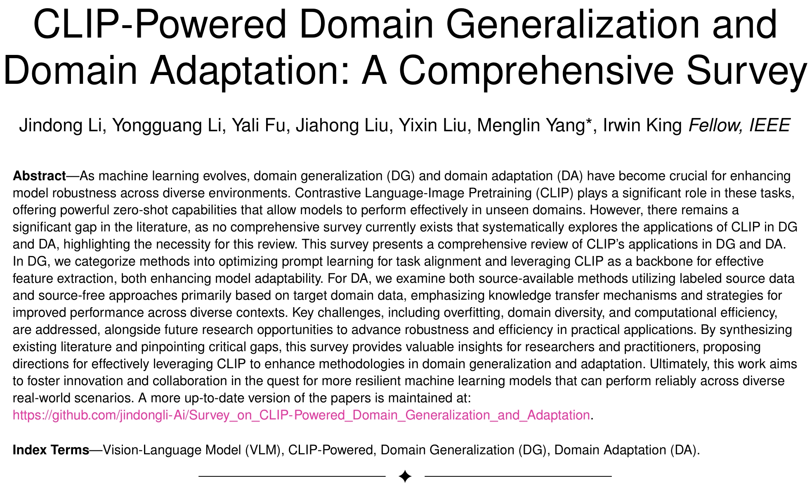

<div align="center">
    <h1><b>CLIP-Powered Domain Generalization and Domain Adaptation: A Comprehensive Survey</b></h1>
</div>

The official GitHub page for the survey paper "CLIP-Powered Domain Generalization and Domain Adaptation: A Comprehensive Survey".


<div align="center">


<a href="https://arxiv.org/abs/2504.14280" target="_blank"></a>

</div>


<div align="center">
[arXiv][https://arxiv.org/abs/2504.14280]
</div>
<div align="center">
[机器之心][https://www.jiqizhixin.com/articles/2025-05-06-5]
</div>


<br>
<br>
<p align="center">
    
</p>
<br>

## 1. Introduction


<p align="center">
    
</p>
<br>
<br>

<p align="center">
    
</p>
<br>
<br>


<p align="center">
    
</p>
<br>
<br>


<p align="center">
    
</p>
<br>


## 2. Preliminaries


<p align="center">
    
</p>
<br>
<br>


<p align="center">
    
</p>
<br>
<br>


<p align="center">
    
</p>
<br>
<br>


<p align="center">
    
</p>
<br>


<p align="center">
    
</p>
<br>


## 3. Domain Generalization

### 3.1 Prompt Optimization Techniques

<p align="center">
    
</p>
<br>

1. 2022_CVPR_Conditional Prompt Learning for Vision-Language Models.
    [[arXiv]](https://arxiv.org/abs/2203.05557)

2. 2022_IJCV_Learning to Prompt for Vision-Language Models.
    [[arXiv]](https://arxiv.org/abs/2109.01134)
   
3. 2023_CVPR_KgCoOp_Visual-Language Prompt Tuning with Knowledge-Guided Context Optimization.
    [[CVPR]](https://openaccess.thecvf.com/content/CVPR2023/papers/Yao_Visual-Language_Prompt_Tuning_With_Knowledge-Guided_Context_Optimization_CVPR_2023_paper.pdf)
   
4. 2023_CVPR_MaPLe_MaPLe: Multi-Modal Prompt Learning.
    [[arXiv]](https://arxiv.org/abs/2210.03117)
   
5. 2023_ICCV_ProGrad_Prompt-aligned Gradient for Prompt Tuning.
    [[ICCV]](https://openaccess.thecvf.com/content/ICCV2023/papers/Zhu_Prompt-aligned_Gradient_for_Prompt_Tuning_ICCV_2023_paper.pdf)

6. 2024_AAAI_LAMM_LAMM: Label Alignment for Multi-Modal Prompt Learning.
    [[arXiv]](https://arxiv.org/abs/2312.08212)
    

### 3.2 CLIP is Adopted as Backbone or Encoder

<p align="center">
    
</p>
<br>


#### 3.2.1 Source-Available (SA)
##### 3.2.1.1 Single-Source Closed-Set Domain Generalization (SS-CSDG)

1. 2023_ICCV_BorLan_Borrowing Knowledge From Pre-trained Language Model: A New Data-efficient Visual Learning Paradigm.
   [[ICCV]](https://openaccess.thecvf.com/content/ICCV2023/papers/Ma_Borrowing_Knowledge_From_Pre-trained_Language_Model_A_New_Data-efficient_Visual_ICCV_2023_paper.pdf)


2. 2023_ICCV_DAPT_Distribution-Aware Prompt Tuning for Vision-Language Models.
   [[arXiv]](https://arxiv.org/abs/2309.03406)


3. 2023_ICCV_PromptSRC_Self-Regulating Prompts: Foundational Model Adaptation without Forgetting.
   [[ICCV]](https://openaccess.thecvf.com/content/ICCV2023/papers/Khattak_Self-regulating_Prompts_Foundational_Model_Adaptation_without_Forgetting_ICCV_2023_paper.pdf)


4. 2024_arXiv_GalLoP_GalLoP: Learning Global and Local Prompts for Vision-Language Models.
   [[arXiv]](https://arxiv.org/abs/2407.01400v1)


5. 2024_arXiv_LDFS_Enhancing Vision-Language Models Generalization via Diversity-Driven Novel Feature Synthesis.
    [[arXiv]](https://arxiv.org/abs/2405.02586)


6. 2024_arXiv_SPG_Soft Prompt Generation for Domain Generalization.
    [[arXiv]](https://arxiv.org/abs/2404.19286)


7. 2024_CVPR_MMA_MMA: Multi-Modal Adapter for Vision-Language Models.
    [[CVPR]](https://openaccess.thecvf.com/content/CVPR2024/html/Yang_MMA_Multi-Modal_Adapter_for_Vision-Language_Models_CVPR_2024_paper.html)


8. 2024_WACV_StyLIP_StyLIP: Multi-Scale Style-Conditioned Prompt Learning for CLIP-based Domain Generalization.
    [[arXiv]](https://arxiv.org/abs/2302.09251)


##### 3.2.1.2 Multi-Source Closed-Set Domain Generalization (MS-CSDG)

1. A Sentence Speaks a Thousand Images: Domain Generalization through Distilling CLIP with Language Guidance.
    [[arXiv]](http://export.arxiv.org/abs/2309.12530)
   
2. Domain Prompt Learning for Efficiently Adapting CLIP to Unseen Domains.
    [[Jstage]](https://www.jstage.jst.go.jp/article/tjsai/38/6/38_38-6_B-MC2/_pdf)

3. Consistent Augmentation Learning for Generalizing CLIP to Unseen Domains.
   [[IEEE]](https://ieeexplore.ieee.org/stamp/stamp.jsp?arnumber=10716475)
   
4. Robust Domain Generalization for Multi-modal Object Recognition.
   [[arXiv]](https://arxiv.org/pdf/2408.05831)
   
5. Soft Prompt Generation for Domain Generalization.
    [[arXiv]](https://arxiv.org/abs/2404.19286)
   
6. Any-Shift Prompting for Generalization over Distributions.
    [[CVPR]](https://openaccess.thecvf.com/content/CVPR2024/papers/Xiao_Any-Shift_Prompting_for_Generalization_over_Distributions_CVPR_2024_paper.pdf)
    
7. Disentangled Prompt Representation for Domain Generalization.
    [[IEEE]](https://ieeexplore.ieee.org/abstract/document/10655401)
   
8. Unknown Prompt, the only Lacuna: Unveiling CLIP’s Potential for Open Domain Generalization.
    [[CVPR]](https://openaccess.thecvf.com/content/CVPR2024/papers/Singha_Unknown_Prompt_the_only_Lacuna_Unveiling_CLIPs_Potential_for_Open_CVPR_2024_paper.pdf)
    
10. Leveraging Vision-Language Models for Improving Domain Generalization in Image Classification.
    [[CVPR]](https://cvpr.thecvf.com/virtual/2024/poster/31364)

11. StyLIP: Multi-Scale Style-Conditioned Prompt Learning for CLIP-based Domain Generalization.
    [[arXiv]](https://arxiv.org/abs/2302.09251)


##### 3.2.1.3 Multi-Source Open-Set Domain Generalization (MS-OSDG)
1. CLIPood: Generalizing CLIP to Out-of-Distributions.
   [[]](https://proceedings.mlr.press/v202/shu23a/shu23a.pdf)
3. Unknown Prompt, the only Lacuna: Unveiling CLIP’s Potential for Open Domain Generalization.
   [[CVPR]](https://openaccess.thecvf.com/content/CVPR2024/papers/Singha_Unknown_Prompt_the_only_Lacuna_Unveiling_CLIPs_Potential_for_Open_CVPR_2024_paper.pdf)
5. PracticalDG: Perturbation Distillation on Vision-Language Models for Hybrid Domain Generalization.
   [[CVPR]](https://openaccess.thecvf.com/content/CVPR2024/papers/Chen_PracticalDG_Perturbation_Distillation_on_Vision-Language_Models_for_Hybrid_Domain_Generalization_CVPR_2024_paper.pdf)


#### 3.2.2 Source-Free (SF)
##### Source(-Fully)-Free Domain Generalization (S(F)F-DG)

1. Domain-Unified Prompt Representations for Source-Free Domain Generalization.
    [[arXiv]](https://arxiv.org/abs/2209.14926)


2. PromptStyler: Prompt-driven Style Generation for Source-free Domain Generalization.
    [[arXiv]](https://arxiv.org/abs/2307.15199)


3. DPStyler: Dynamic PromptStyler for Source-Free Domain Generalization.
    [[arXiv]](https://arxiv.org/abs/2403.16697)


4. PromptTA: Prompt-driven Text Adapter for Source-free Domain Generalization.
    [[arXiv]](https://arxiv.org/abs/2409.14163)


## 4. Domain Adaptation

### 4.1 Source-Available (SA)

#### 4.1.1 Single-Source (SS)

##### 4.1.1.1 Single-Source Closed-Set Unsupervised Domain Adaptation (SS-CSUDA)
1. PADCLIP: Pseudo-labeling with Adaptive Debiasing in CLIP for Unsupervised Domain Adaptation.
    [[IEEE]](https://ieeexplore.ieee.org/document/10377727)


2. AD-CLIP: Adapting Domains in Prompt Space Using CLIP.
    [[IEEE]](https://ieeexplore.ieee.org/document/10351000)

 
3. Domain Adaptation via Prompt Learning.
    [[IEEE]](https://ieeexplore.ieee.org/document/10313995)


4. Prompt-based Distribution Alignment for Unsupervised Domain Adaptation.
    [[arXiv]](https://arxiv.org/abs/2312.09553v1)


5. CLIP the Divergence: Language-guided Unsupervised Domain Adaptation.
    [[arXiv]](https://arxiv.org/abs/2407.01842)


6. Domain-Agnostic Mutual Prompting for Unsupervised Domain Adaptation.
    [[arXiv]](https://arxiv.org/abs/2403.02899)


7. Split to Merge: Unifying Separated Modalities for Unsupervised Domain Adaptation.
    [[arXiv]](https://arxiv.org/abs/2403.06946v1)


8. Enhancing Vision-Language Models Incorporating TSK Fuzzy System for Domain Adaptation.
    [[IEEE]](https://ieeexplore.ieee.org/abstract/document/10612077)


9. CLIP-Enhanced Unsupervised Domain Adaptation with Consistency Regularization.
    [[IEEE]](https://ieeexplore.ieee.org/abstract/document/10650901)


10. Unsupervised Domain Adaption Harnessing Vision-Language Pre-training.
    [[arXiv]](https://arxiv.org/abs/2408.02192)


11. Unsupervised Domain Adaptation Enhanced by Fuzzy Prompt Learning.
    [[IEEE]](https://ieeexplore.ieee.org/abstract/document/10502168)


12. Empowering Unsupervised Domain Adaptation with Large-scale Pre-trained Vision-Language Models.
    [[IEEE]](https://ieeexplore.ieee.org/document/10484237)


##### 4.1.1.2 Single-Source Open-Set Unsupervised Domain Adaptation (SS-OSUDA)

1. Open-Set Domain Adaptation with Visual-Language Foundation Models.
    [[arXiv]](https://arxiv.org/abs/2307.16204)


2. Decoupling Domain Invariance and Variance With Tailored Prompts for Open-Set Domain Adaptation.
    [[IEEE]](https://ieeexplore.ieee.org/document/10647719)


3. COSMo: CLIP Talks on Open-Set Multi-Target Domain Adaptation.
    [[arXiv]](https://arxiv.org/abs/2409.00397v1)


#### 4.1.2 Multi-Source (MS)

##### 4.1.2.1 Multi-Source Closed-Set Unsupervised Domain Adaptation (MS-CSUDA)
1. Multi-Prompt Alignment for Multi-Source Unsupervised Domain Adaptation.
    [[arXiv]](https://arxiv.org/abs/2209.15210)

   
2. LanDA: Language-Guided Multi-Source Domain Adaptation.
    [[arXiv]](https://arxiv.org/abs/2401.14148)


##### 4.1.2.2 Multi-Source Open-Partial-Set Unsupervised Domain Adaptation (MS-OPSUDA) a.k.a. Universal Multi-Source Domain Adaptation (UniMDA)
1. Semantic-Aware Adaptive Prompt Learning for Universal Multi-Source Domain Adaptation.
    [[arXiv]](https://ieeexplore.ieee.org/document/10502133)

##### 4.1.2.3 Multi-Source Few-Shot Domain Adaptation (MS-FSDA)
1. Domain Prompt Matters a Lot in Multi-Source Few-Shot Domain Adaptation.
    [[arXiv]](https://openreview.net/forum?id=YRJDZYGmAZ)


### 4.2 Source-Free (SF)

#### 4.2.1 Source-Fully-Free (SFF)

##### 4.2.1.1 Source-Fully-Free Closed-Set Unsupervised Domain Adaptation (SFF-CSUDA) a.k.a. Unsupervised Fine-Tuning (CS-UFT)

1. Unsupervised Prompt Learning for Vision-Language Models.
    [[arXiv]](https://arxiv.org/abs/2204.03649)


2. POUF: Prompt-oriented unsupervised fine-tuning for large pre-trained models.
    [[arXiv]](https://arxiv.org/abs/2305.00350)


3. DPA: Dual Prototypes Alignment for Unsupervised Adaptation of Vision-Language Models.
    [[arXiv]](https://arxiv.org/abs/2408.08855)


5. Training-Free Unsupervised Prompt for Vision-Language Models.
    [[arXiv]](https://arxiv.org/abs/2404.16339)


7. Rethinking Domain Adaptation and Generalization in the Era Of CLIP.
    [[IEEE]](https://ieeexplore.ieee.org/abstract/document/10647766)


9. Candidate Pseudolabel Learning: Enhancing Vision-Language Models by Prompt Tuning with Unlabeled Data.
    [[arXiv]](https://arxiv.org/abs/2406.10502)


11. Realistic Unsupervised CLIP Fine-tuning with Universal Entropy Optimization.
    [[arXiv]](https://arxiv.org/abs/2308.12919)


13. LaFTer: Label-Free Tuning of Zero-shot Classifier using Language and Unlabeled Image Collections.
    [[arXiv]](https://arxiv.org/abs/2305.18287)


15. ReCLIP: Refine Contrastive Language Image Pre-Training with Source Free Domain Adaptation.
    [[arXiv]](https://arxiv.org/abs/2308.03793)


##### 4.2.1.2 Source-Fully-Free Partial-Set Unsupervised Domain Adaptation (SFF-PSUDA) a.k.a. Partial-Set Unsupervised Fine-Tuning (PS-UFT)
1. [Realistic Unsupervised CLIP Fine-tuning with Universal Entropy Optimization](https://arxiv.org/abs/2308.12919)

##### 4.2.1.3 Source-Fully-Free Open-Set Unsupervised Domain Adaptation (SFF-OSUDA) a.k.a. Open-Set Unsupervised Fine-Tuning (OS-UFT)
1. [Realistic Unsupervised CLIP Fine-tuning with Universal Entropy Optimization](https://arxiv.org/abs/2308.12919)

##### 4.2.1.4 Source-Fully-Free Open-Partial-Set Unsupervised Domain Adaptation (SFF-OPSUDA) a.k.a Open-Partial-Set Unsupervised Fine-Tuning (OPS-UFT)
1. [Realistic Unsupervised CLIP Fine-tuning with Universal Entropy Optimization](https://arxiv.org/abs/2308.12919)


#### 4.2.2 Source-Data-Free (SDF)
##### 4.2.2.1 Source-Data-Free Closed-Set Unsupervised Domain Adaptation (SDF-CSUDA)
1. [Source-Free Domain Adaptation with Frozen Multimodal Foundation Model](https://ieeexplore.ieee.org/document/10654933)
2. [Source-Free Domain Adaptation Guided by Vision and Vision-Language Pre-Training](https://arxiv.org/abs/2405.02954)
3. [Data-Efficient CLIP-Powered Dual-Branch Networks for Source-Free Unsupervised Domain Adaptation](https://arxiv.org/abs/2410.15811)
4. [CLIP-guided black-box domain adaptation of image classification](https://link.springer.com/article/10.1007/s11760-024-03101-8)

##### 4.2.2.2 Source-Data-Free Partial-Set Unsupervised Domain Adaptation (SDF-PSUDA)
1. [Source-Free Domain Adaptation with Frozen Multimodal Foundation Model](https://ieeexplore.ieee.org/document/10654933)
2. [Source-Free Domain Adaptation Guided by Vision and Vision-Language Pre-Training](https://arxiv.org/abs/2405.02954)

##### 4.2.2.3 Source-Data-Free Open-Set Unsupervised Domain Adaptation (SDF-OSUDA)
1. [Open-Set Domain Adaptation with Visual-Language Foundation Models](https://arxiv.org/abs/2307.16204)
2. [Source-Free Domain Adaptation with Frozen Multimodal Foundation Model](https://ieeexplore.ieee.org/document/10654933)
3. [Source-Free Domain Adaptation Guided by Vision and Vision-Language Pre-Training](https://arxiv.org/abs/2405.02954)


<p align="center">
    
</p>
<br>


<p align="center">
    
</p>
<br>


<p align="center">
    
</p>
<br>


<!--

<table>
  <thead>
    <tr>
      <th rowspan="3", colspan='3'>Scenario</th>
      <th colspan="3">Pre-train in Source Domain</th>
      <th colspan="2">Adapt in Target Domain</th>
      <th colspan="4">Category between Source Domain and Target Domain</th>
    </tr>
    <tr>
      <th colspan='2'>Source Domain</th>
      <th rowspan='2'>Target Domain</th>
      <th rowspan='2'>Source Domain Data</th>
      <th rowspan='2'>Source Domain Knowledge</th>
      <th rowspan='2'>Closed-Set</th>
      <th rowspan='2'>Partial-Set</th>
      <th rowspan='2'>Open-Set</th>
      <th rowspan='2'>Open-Partial-Set</th>
    </tr>
    <tr>
      <th>Single-Source</th>
      <th>Multi-Souirce</th>
    </tr>
  </thead>
  <tbody>
    <tr>
      <td rowspan="4">DG</td>
      <td rowspan='3'>Source-Available (SA)</td>
      <td>Single-Source Domain Generalization (SS-DG)</td>
      <td>✅</td>
      <td></td>
      <td></td>
      <td></td>
      <td></td>
      <td>✅</td>
      <td>✅</td>
      <td>✅</td>
      <td></td>
    </tr>
    <tr>
      <td>Multi-Source Closed-Set Domain Generalization (MS-CSDG)</td>
      <td></td>
      <td>✅</td>
      <td></td>
      <td></td>
      <td></td>
      <td>✅</td>
      <td></td>
      <td></td>
      <td></td>
    </tr>
    <tr>
      <td>Multi-Source Domain Open-Set Generalization (MS-OSDG)</td>
      <td></td>
      <td>✅</td>
      <td></td>
      <td></td>
      <td></td>
      <td></td>
      <td></td>
      <td>✅</td>
      <td></td>
    </tr>
      <td>Source-Free (SF)</td>
      <td>Source-(Fully)-Free Domain Generalization (S(F)F-DG)</td>
      <td></td>
      <td></td>
      <td></td>
      <td></td>
      <td></td>
      <td>✅</td>
      <td>✅</td>
      <td>✅</td>
      <td></td>
    <tr>
      <td rowspan="11">DA</td>
      <td rowspan="4">Source-Available (SA)</td>
      <td>Single-Source Closed-Set Unsupervised Domain Adaptation (SS-CSUDA)</td>
      <td>✅</td>
      <td></td>
      <td>✅</td>
      <td>✅</td>
      <td>✅</td>
      <td>✅</td>
      <td></td>
      <td></td>
      <td></td>
    </tr>
    <tr>
      <td>Single-Source Open-Set Unsupervised Domain Adaptation (SS-OSUDA)</td>
      <td>✅</td>
      <td></td>
      <td>✅</td>
      <td>✅</td>
      <td>✅</td>
      <td></td>
      <td></td>
      <td>✅</td>
      <td></td>
    </tr>
    <tr>
      <td>Multi-Source Unsupervised Domain Adaptation (MS-UDA)</td>
      <td></td>
      <td>✅</td>
      <td></td>
      <td></td>
      <td></td>
      <td>✅</td>
      <td>✅</td>
      <td>✅</td>
      <td></td>
    </tr>
    <tr>
      <td>Multi-Source Few-Shot Domain Adaptation (MS-FSDA)</td>
      <td></td>
      <td>✅</td>
      <td></td>
      <td></td>
      <td></td>
      <td>✅</td>
      <td>✅</td>
      <td>✅</td>
      <td></td>
    </tr>
    <tr>
      <td rowspan="7">Source-Free (SF)</td>
      <td>Source-Fully-Free Closed-Set Unsupervised Domain Adaptation (SFF-CSUDA) a.k.a. Closed-Set Unsupervised Fine-Tuning (CS-UFT)</td>
      <td></td>
      <td></td>
      <td></td>
      <td></td>
      <td></td>
      <td>✅</td>
      <td></td>
      <td></td>
      <td></td>
    </tr>
    <tr>
      <td>Source-Fully-Free Partial-Set Unsupervised Domain Adaptation (SFF-PSUDA) a.k.a. Partial-Set Unsupervised Fine-Tuning (PS-UFT)</td>
      <td></td>
      <td></td>
      <td></td>
      <td></td>
      <td></td>
      <td></td>
      <td>✅</td>
      <td></td>
      <td></td>
    </tr>
    <tr>
      <td>Source-Fully-Free Open-Set Unsupervised Domain Adaptation (SFF-OSUDA) a.k.a. Open-Set Unsupervised Fine-Tuning (OS-UFT)</td>
      <td></td>
      <td></td>
      <td></td>
      <td></td>
      <td></td>
      <td></td>
      <td></td>
      <td>✅</td>
      <td></td>
    </tr>
    <tr>
      <td>Source-Fully-Free Open-Partial-Set Unsupervised Domain Adaptation (SFF-OPSUDA) a.k.a. Open-Partial-Set Unsupervised Fine-Tuning (OPS-UFT)</td>
      <td></td>
      <td></td>
      <td></td>
      <td></td>
      <td></td>
      <td></td>
      <td></td>
      <td></td>
      <td>✅</td>
    </tr>
    <tr>
      <td>Source-Data-Free Closed-Set Unsupervised Domain Adaptation (SDF-CSUDA)</td>
      <td></td>
      <td></td>
      <td></td>
      <td></td>
      <td>✅</td>
      <td>✅</td>
      <td></td>
      <td></td>
      <td></td>
    </tr>
    <tr>
      <td>Source-Data-Free Partial-Set Unsupervised Domain Adaptation (SDF-PSUDA)</td>
      <td></td>
      <td></td>
      <td></td>
      <td></td>
      <td>✅</td>
      <td></td>
      <td>✅</td>
      <td></td>
      <td></td>
    </tr>
    <tr>
      <td>Source-Data-Free Open-Set Unsupervised Domain Adaptation (SDF-OSUDA)</td>
      <td></td>
      <td></td>
      <td></td>
      <td></td>
      <td>✅</td>
      <td></td>
      <td></td>
      <td>✅</td>
      <td></td>
    </tr>
  </tbody>
</table>

-->


## Datasets and Metrics

### Common Datasets


<table>
  <thead>
    <tr>
      <th><b>Field</b></th>
      <th><b>Dataset</b></th>
      <th><b>#Domains</b></th>
      <th><b>#Categories</b></th>
      <th><b>#Images</b></th>
      <th><b>Link</b></th>
    </tr>
  </thead>
  <tbody>
    <tr>
      <td rowspan="9"><b>Multi-domain Dataset</b></td>
      <td>Office-Home</td>
      <td>4</td>
      <td>65</td>
      <td>15,588</td>
      <td><a href="https://faculty.cc.gatech.edu/~judy/domainadapt/">https://faculty.cc.gatech.edu/~judy/domainadapt/</a></td>
    </tr>
    <tr>
      <td>Office-31</td>
      <td>3</td>
      <td>31</td>
      <td>4,652</td>
      <td><a href="https://www.hemanthdv.org/officeHomeDataset.html">https://www.hemanthdv.org/officeHomeDataset.html</a></td>
    </tr>
    <tr>
      <td>VisDA-2017</td>
      <td>2</td>
      <td>12</td>
      <td>280,000</td>
      <td><a href="https://github.com/VisionLearningGroup/taskcv-2017-public">https://github.com/VisionLearningGroup/taskcv-2017-public</a></td>
    </tr>
    <tr>
      <td>DomainNet</td>
      <td>6</td>
      <td>345</td>
      <td>586,575</td>
      <td><a href="https://ai.bu.edu/M3SDA/">https://ai.bu.edu/M3SDA/</a></td>
    </tr>
    <tr>
      <td>PACS</td>
      <td>4</td>
      <td>7</td>
      <td>9,991</td>
      <td><a href="https://www.kaggle.com/datasets/nickfratto/pacs-dataset">https://www.kaggle.com/datasets/nickfratto/pacs-dataset</a></td>
    </tr>
    <tr>
      <td>VLCS</td>
      <td>4</td>
      <td>5</td>
      <td>10,729</td>
      <td><a href="https://www.kaggle.com/datasets/iamjanvijay/vlcsdataset/data">https://www.kaggle.com/datasets/iamjanvijay/vlcsdataset/data</a></td>
    </tr>
    <tr>
      <td>Digits-DG</td>
      <td>4</td>
      <td>10</td>
      <td>24,000</td>
      <td><a href="https://csip.fzu.edu.cn/files/datasets/SSDG/digits_dg.zip">https://csip.fzu.edu.cn/files/datasets/SSDG/digits_dg.zip</a></td>
    </tr>
    <tr>
      <td>TerraIncognita</td>
      <td>4</td>
      <td>10</td>
      <td>24,330</td>
      <td><a href="https://beerys.github.io/CaltechCameraTraps/">https://beerys.github.io/CaltechCameraTraps/</a></td>
    </tr>
    <tr>
      <td>NICO++</td>
      <td>6</td>
      <td>7</td>
      <td>89,232</td>
      <td><a href="https://github.com/xxgege/NICO-plus">https://github.com/xxgege/NICO-plus</a></td>
    </tr>
    <tr>
      <td rowspan="17"><b>Single-domain Dataset</b></td>
      <td>ImageNet</td>
      <td>1</td>
      <td>1000</td>
      <td>1.28M</td>
      <td><a href="https://www.image-net.org/download.php">https://www.image-net.org/download.php</a></td>
    </tr>
    <tr>
      <td>ImageNetV2</td>
      <td>1</td>
      <td>1000</td>
      <td>10,000</td>
      <td><a href="https://github.com/modestyachts/ImageNetV2">https://github.com/modestyachts/ImageNetV2</a></td>
    </tr>
    <tr>
      <td>ImageNet-Sketch</td>
      <td>1</td>
      <td>1000</td>
      <td>50,889</td>
      <td><a href="https://github.com/HaohanWang/ImageNet-Sketch">https://github.com/HaohanWang/ImageNet-Sketch</a></td>
    </tr>
    <tr>
      <td>ImageNet-A</td>
      <td>1</td>
      <td>200</td>
      <td>7,500</td>
      <td><a href="https://github.com/hendrycks/natural-adv-examples">https://github.com/hendrycks/natural-adv-examples</a></td>
    </tr>
    <tr>
      <td>ImageNet-R</td>
      <td>1</td>
      <td>200</td>
      <td>30,000</td>
      <td><a href="https://github.com/hendrycks/imagenet-r">https://github.com/hendrycks/imagenet-r</a></td>
    </tr>
    <tr>
      <td>CIFAR10</td>
      <td>1</td>
      <td>10</td>
      <td>60,000</td>
      <td><a href="https://www.cs.toronto.edu/~kriz/cifar.html">https://www.cs.toronto.edu/~kriz/cifar.html</a></td>
    </tr>
    <tr>
      <td>CIFAR100</td>
      <td>1</td>
      <td>100</td>
      <td>60,000</td>
      <td><a href="https://www.cs.toronto.edu/~kriz/cifar.html">https://www.cs.toronto.edu/~kriz/cifar.html</a></td>
    </tr>
    <tr>
      <td>Caltech101</td>
      <td>1</td>
      <td>100</td>
      <td>8,242</td>
      <td><a href="https://www.kaggle.com/datasets/imbikramsaha/caltech-101">https://www.kaggle.com/datasets/imbikramsaha/caltech-101</a></td>
    </tr>
    <tr>
      <td>DTD</td>
      <td>1</td>
      <td>47</td>
      <td>5,640</td>
      <td><a href="https://www.robots.ox.ac.uk/~vgg/data/dtd/">https://www.robots.ox.ac.uk/~vgg/data/dtd/</a></td>
    </tr>
    <tr>
      <td>EuroSAT</td>
      <td>1</td>
      <td>10</td>
      <td>2,700</td>
      <td><a href="https://www.kaggle.com/datasets/apollo2506/eurosat-dataset">https://www.kaggle.com/datasets/apollo2506/eurosat-dataset</a></td>
    </tr>
    <tr>
      <td>FGVCAircraft</td>
      <td>1</td>
      <td>100</td>
      <td>10,000</td>
      <td><a href="https://www.robots.ox.ac.uk/~vgg/data/fgvc-aircraft/">https://www.robots.ox.ac.uk/~vgg/data/fgvc-aircraft/</a></td>
    </tr>
    <tr>
      <td>Food101</td>
      <td>1</td>
      <td>101</td>
      <td>101,000</td>
      <td><a href="https://www.kaggle.com/datasets/dansbecker/food-101">https://www.kaggle.com/datasets/dansbecker/food-101</a></td>
    </tr>
    <tr>
      <td>Flowers102</td>
      <td>1</td>
      <td>101</td>
      <td>8,189</td>
      <td><a href="https://www.kaggle.com/datasets/demonplus/flower-dataset-102">https://www.kaggle.com/datasets/demonplus/flower-dataset-102</a></td>
    </tr>
    <tr>
      <td>OxfordPets</td>
      <td>1</td>
      <td>37</td>
      <td>7,349</td>
      <td><a href="https://www.robots.ox.ac.uk/~vgg/data/pets/">https://www.robots.ox.ac.uk/~vgg/data/pets/</a></td>
    </tr>
    <tr>
      <td>SUN397</td>
      <td>1</td>
      <td>397</td>
      <td>39,700</td>
      <td><a href="https://huggingface.co/datasets/1aurent/SUN397">https://huggingface.co/datasets/1aurent/SUN397</a></td>
    </tr>
    <tr>
      <td>StandfordCars</td>
      <td>1</td>
      <td>196</td>
      <td>16,185</td>
      <td><a href="https://www.kaggle.com/datasets/jessicali9530/stanford-cars-dataset/data">https://www.kaggle.com/datasets/jessicali9530/stanford-cars-dataset/data</a></td>
    </tr>
    <tr>
      <td>UCF101</td>
      <td>1</td>
      <td>101</td>
      <td>13,320</td>
      <td><a href="https://www.kaggle.com/datasets/matthewjansen/ucf101-action-recognition">https://www.kaggle.com/datasets/matthewjansen/ucf101-action-recognition</a></td>
    </tr>
  </tbody>
</table>


## Challenges and Opportunities

## Future Directions

## 📖 Citation

If you find this work helpful, please consider citing our paper:

```bibtex
@article{li2025clip,
  title={CLIP-Powered Domain Generalization and Domain Adaptation: A Comprehensive Survey},
  author={Li, Jindong and Li, Yongguang and Fu, Yali and Liu, Jiahong and Liu, Yixin and Yang, Menglin and King, Irwin},
  journal={arXiv preprint arXiv:2504.14280},
  year={2025}
}
